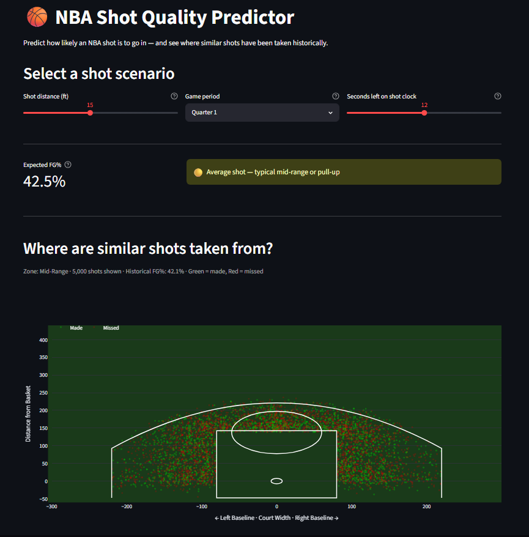
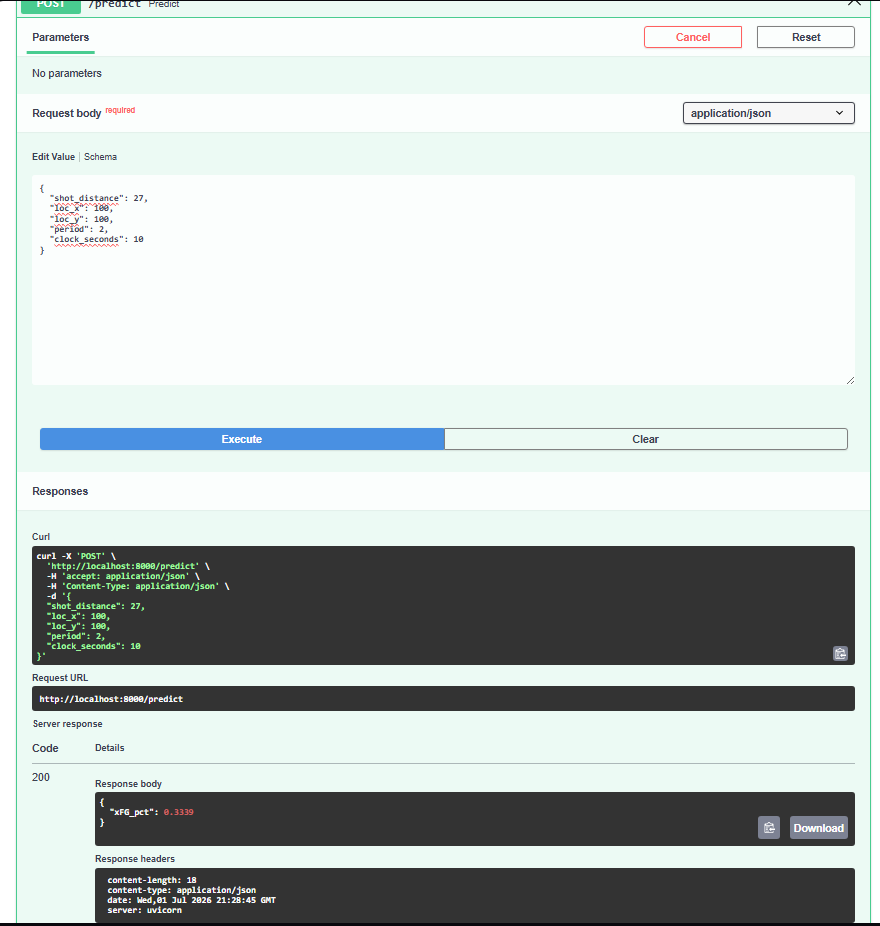

Predicts the expected field goal percentage (xFG%) of any NBA shot using location, game context, and shot zone. Trained on 1.2M+ shots across 5 seasons of play-by-play data.

Live dashboard: coming soon
API docs: run locally at http://localhost:8000/docs

Screenshots

# Results

AUC: 0.6446
Baseline (always predict mean): ~0.50
Training data: 1.2M+ shots, 2019–2024

AUC of 0.64 with only shot location and game context — no defender distance or player identity — is consistent with published xFG models using the same feature set.

# How it works

Ingestion — pulls 5 seasons of shot chart data from the NBA Stats API via nba_api, stores each season as a Parquet file
Cleaning — filters to valid court coordinates, engineers CLOCK_SECONDS, one-hot encodes shot zones
Training — XGBoost classifier wrapped in isotonic calibration so predicted probabilities match real FG% (~45–47%); tracked with MLflow
Orchestration — Prefect flow runs ingest → clean → train in order with automatic retries on ingest
API — FastAPI /predict endpoint accepts shot distance, coordinates, period, and clock time; returns xFG%
Dashboard — Streamlit app with an interactive court plot filtered by shot zone, updating live as you adjust inputs

# Run locally

bashgit clone https://github.com/yourusername/nba-shot-model
cd nba-shot-model
python -m venv venv

venv\Scripts\activate        # Windows
source venv/bin/activate   # Mac/Linux

pip install -r requirements.txt

# Run the full pipeline (ingest → clean → train)
python pipeline/flow.py

# Start the prediction API
uvicorn api.main:app --reload

# Launch the dashboard
streamlit run dashboard/app.py

# Project structure

nba-shot-model/
├── pipeline/
│   ├── ingest.py        # pulls shot data from NBA API
│   ├── clean.py         # feature engineering + encoding
│   ├── train.py         # XGBoost + MLflow tracking
│   └── flow.py          # Prefect orchestration
├── api/
│   └── main.py          # FastAPI prediction endpoint
├── dashboard/
│   └── app.py           # Streamlit dashboard
├── models/              # saved model + feature list (gitignored)
├── data/                # raw + processed Parquet files (gitignored)
├── requirements.txt
└── README.md

# Stack

Data: nba_api, pandas, pyarrow
ML: xgboost, scikit-learn, mlflow
Orchestration: prefect
API: fastapi, uvicorn
Dashboard: streamlit, plotly
